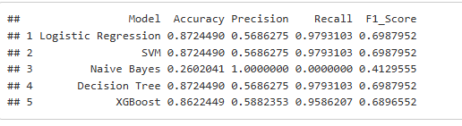
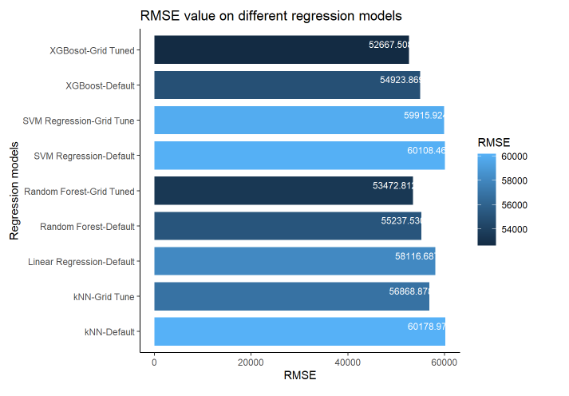

# Loan Eligibility and Amount Prediction

This is a group assignment for WQD 7004 Programming for Data Science for the Master of Data Science at University of Malaya (UM). This project explore loan eligibility prediction based on the customer input. The [report](report/Group%20Project%20Report.pdf) of this project can be found at the [report folder](report/). 

The dataset used in this project is obtained from [Kaggle](https://www.kaggle.com/datasets/yashpaloswal/loan-prediction-with-3-problem-statement).

Image Attribution: Photo by [Karolina Kaboompics](https://www.pexels.com/photo/hands-holding-dollars-4968639/)

---

### Introduction

A Company wants to automate the loan eligibility process based on customer details provided while filling online application form. The details filled by the customer are Gender, Marital Status, Education, Number of Dependents, Income of self and co applicant, Required Loan Amount, Required Loan Term, Credit History and others. The requirements are as follows:

1. Check eligibility of the Customer given the inputs described above. (Classification)
2. If customer is not eligible for the input required amount and duration, what can be amount for the given duration. (Regression)

### Findings
For customer loan approval status, logistic regression, support vector machines, and decision trees all achieved the same result, meeting the project objective. Future work can focus on hyperparameter tuning to optimize these models. 

For predicting the approved loan amount, the XGBoost regression model outperformed five other models, having the lowest RMSE and highest R-squared value.

---

### Results

The demo report link can be found at [here](https://samueltan3972.github.io/backup/WQD7004-ProgrammingInDataScience.html).

#### Loan Approval Status Model Result

#### Loan Eligible Amount Prediction Model Result
